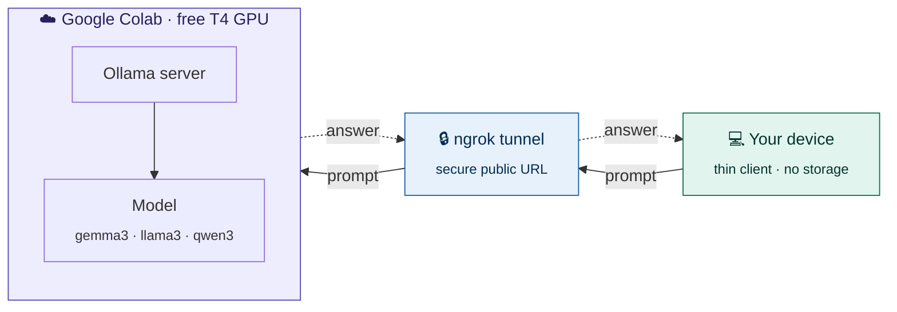

<div align="center">

# 🚀 colab-llm-host

**Turn a free Google Colab session into your own LLM backend — no GPU, no cost, no local setup.**


</div>

---

## Architecture



Your device sends a prompt to a public URL. The tunnel forwards it to Colab, where Ollama runs the model and sends the answer back — all your device does is type and display.

---

## ⚡ Quick start

1. Open **`colab_llm_host.ipynb`** in Colab → set runtime to **T4 GPU**
2. Grab a free [ngrok token](https://dashboard.ngrok.com/get-started/your-authtoken), paste it in
3. **Run all** → copy the public URL it prints

First run ~10 min (model download). After that, instant.

---

## 💬 Use it from anywhere

**Windows (PowerShell)**
```powershell
$q = Read-Host "Ask"
$body = @{ model = "gemma3:4b"; prompt = $q; stream = $false } | ConvertTo-Json
(Invoke-RestMethod -Uri "https://YOUR-URL.ngrok-free.dev/api/generate" -Method Post -Body $body -ContentType "application/json").response
```

**Mac / Linux**
```bash
curl https://YOUR-URL.ngrok-free.dev/api/generate -d '{"model":"gemma3:4b","prompt":"what is india","stream":false}'
```

Or point any OpenAI-compatible app (Open WebUI, Continue) at your URL.

---

## 🧠 Models

| Model | Speed | Best for |
|-------|-------|----------|
| `gemma3:1b` | ⚡ fastest | quick questions |
| `gemma3:4b` | fast | everyday use *(recommended)* |
| `llama3.2:3b` | fast | all-rounder |
| `qwen3:8b` | slower | reasoning tasks |

> Skip `qwen3` / `deepseek-r1` if you want instant replies — they "think" before answering.

---

## 📝 Notes

- Sessions are temporary; the URL changes on restart. For always-on, run the same setup on an [Oracle Always Free](https://www.oracle.com/cloud/free/) VM.
- Never commit your ngrok token.

<div align="center"><sub>Free LLMs, zero hardware.</sub></div>
